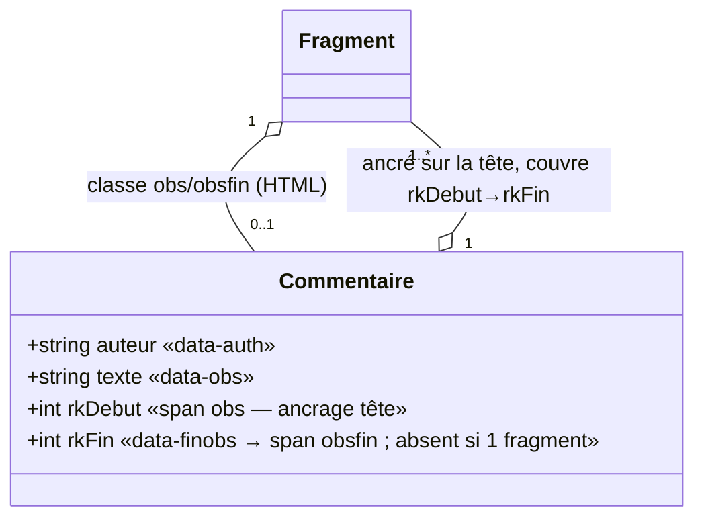
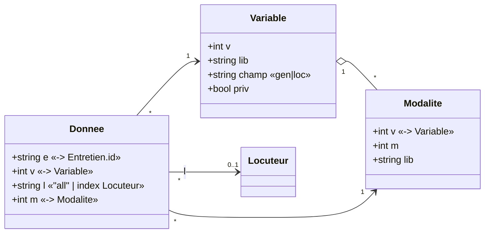
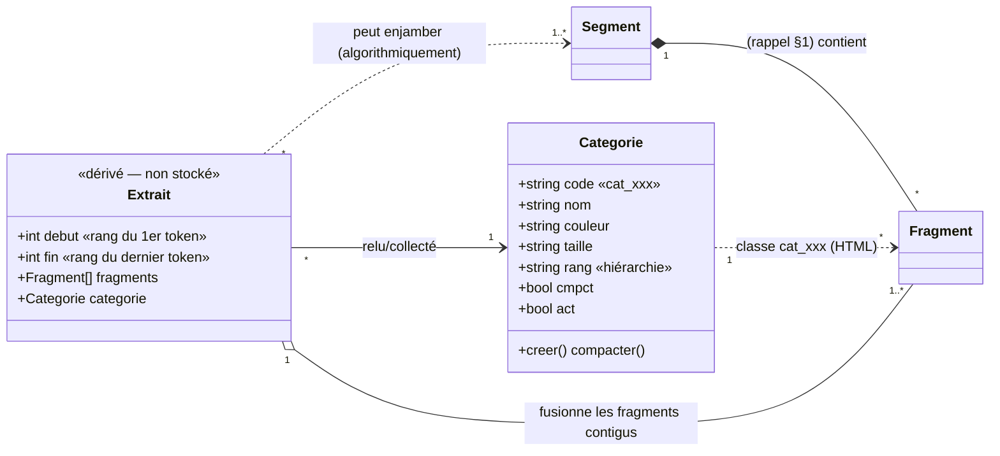
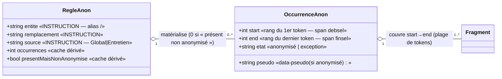
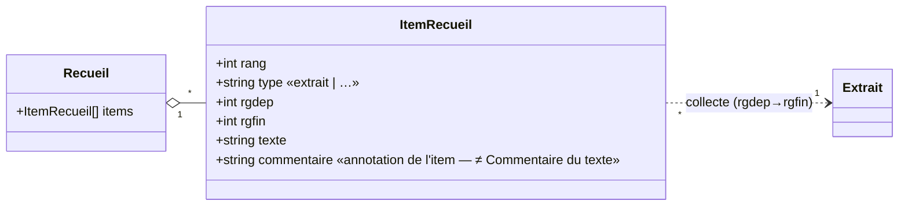
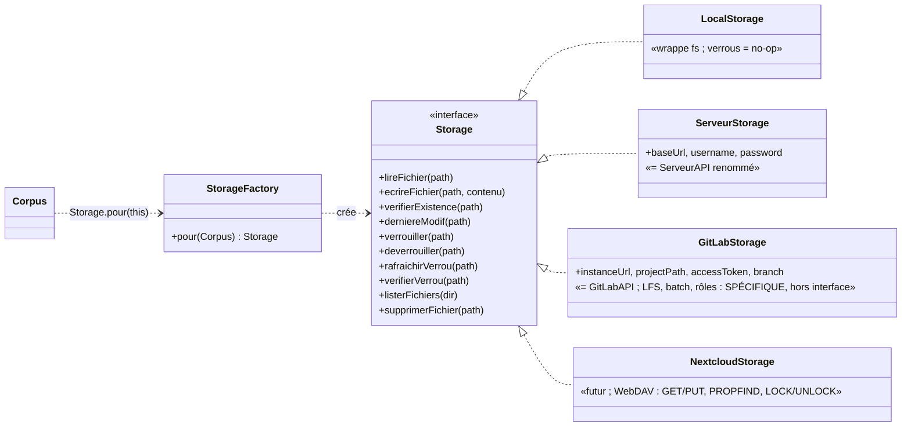

# Modèle objet de SonalPi — vue à 3 niveaux

> Schéma de rétro-ingénierie. SonalPi est écrit en JS procédural (Electron : `main.js` + `modules/*.js`),
> mais manipule des **objets implicites** dispersés en « tableaux globaux » (`tabXxx`) et en attributs HTML.
> Ce document reconstitue ces objets ; il sert de **carte**, pas de plan de refonte.

---

## Principe d'organisation (les 3 niveaux)

| Niveau | Contenu | Forme |
|---|---|---|
| **1 — Vue d'ensemble** | les **agrégats** et la colonne vertébrale du texte | §1, §2 — court et stable |
| **2 — Sous-schémas par préoccupation** | un cluster cohérent, sa logique interne, sa note de cadrage | §3 à §7 — un diagramme chacun |
| **3 — Notes en prose** | états, asymétries, flux, caches, attributs | encarts `>` dans chaque section + §8 |

---

# Niveau 1 — Vue d'ensemble

## 1. Les agrégats

> **Qu'est-ce qu'un « agrégat » ?** (terme *Domain-Driven Design*) c'est une
> **frontière de cohérence** : un cluster d'objets traité comme **une seule unité**.  Aujourd'hui l'agrégat est **implicite** : ce sont les fichiers qui trahissent les
> frontières — aucune classe ne *possède* encore vraiment ses sous-objets (le rendre explicite =
> [PlanPoo](../plans/PlanPoo.md) Phase 3).

> **Pourquoi 2 agrégats dans notre analyse.** La correspondance fichier↔objet (§8.2) est le meilleur guide pour tracer les
> frontières de cohérence : le `.crp` = l'agrégat **Corpus** ; chaque `.sonal` = l'agrégat **Document**
> d'un **Entretien**. *Où* vit physiquement un fichier (local / serveur / GitLab) est une préoccupation
> **technique** distincte, isolée en §7.


Le diagramme ci-dessous est la **carte complète** — tous les
objets et toutes les relations d'un coup, quitte à être dense : c'est l'**index**. Les §2–§7 en sont des
**zooms lisibles** par préoccupation (redondance assumée : un objet peut réapparaître dans son sous-schéma, accompagné d'un texte d'explication).

```mermaid
classDiagram
    direction LR

    class Corpus {
        +string type   «local|distant|gitlab»
        +string folder
        +Entretien[] entretiens «tabEnt»
        +Variable[] variables   «tabVar»
        +Modalite[] modalites   «tabDic»
        +Donnee[] donnees       «tabDat — cache global»
        +Categorie[] codebook   «tabThm»
        +RegleAnon[] reglesAnon «tabAnon — règles + cache d'occurrences/états (cf. §5)»
        +ouvrir() sauvegarder() inventaireVariables()
    }

    class Entretien {
        +string id
        +string nom
        +string rtrPath   «fichier .sonal»
        +string audioPath
        +string imgPath   «waveform»
        +string notes     «champ texte libre»
        +Locuteur[] tabLoc
        +Donnee[] tabDat   «vérité locale»
        +Variable[] tabVar  «copie locale»
        +Modalite[] tabDic  «copie locale»
        +RegleAnon[] tabAnon
        +Document document
        +charger() sauvegarderSonal() exporter()
    }

    class Document {
        +string html   «#segments / #contenuText»
        +Segment[] segments
        +reinitRk() undo() redo()
    }

    class Segment {
        +int rksg
        +float deb
        +float fin
        +int loc        «-> Locuteur»
        +string statut  «deb|fin de tour»
        +Fragment[] fragments
        +creer() fusionner() selectionner()
    }

    class Fragment {
        +int rk          «rang du 1er token (data-rk)»
        +int len         «nb de tokens (data-len)»
        +int sg          «rang du segment parent»
        +string[] codes  «classes cat_xxx + anon + obs»
        +coder() decoder()
    }

    class Extrait {
        <<dérivé — non stocké>>
        +int debut
        +int fin
        +Fragment[] fragments
        +Categorie categorie
    }

    class Locuteur {
        +int index
        +string nom
    }

    class Donnee {
        +string e   «-> Entretien.id»
        +int v      «-> Variable»
        +string l   «"all" | index Locuteur»
        +int m      «-> Modalite»
    }

    class Variable {
        +int v
        +string lib
        +string champ   «gen|loc»
        +bool priv
    }

    class Modalite {
        +int v   «-> Variable»
        +int m
        +string lib
    }

    class Categorie {
        +string code   «cat_xxx»
        +string nom
        +string rang   «hiérarchie»
        +bool cmpct
        +bool act
    }

    class RegleAnon {
        +string entite          «INSTRUCTION — alias séparés par /»
        +string remplacement    «INSTRUCTION»
        +string source          «INSTRUCTION — Global|Entretien»
        +int occurrences        «cache dérivé»
        +bool presentMaisNonAnonymise «cache dérivé»
    }

    class OccurrenceAnon {
        +int start       «rang du 1er token — span debsel»
        +int end         «rang du dernier token — span finsel»
        +string etat     «anonymisé | exception»
        +string pseudo   «data-pseudo (si anonymisé)»
    }

    class Commentaire {
        +string auteur   «data-auth»
        +string texte    «data-obs»
        +int rkDebut     «span obs»
        +int rkFin       «data-finobs → span obsfin»
    }

    Corpus "1" o-- "*" Entretien
    Corpus "1" o-- "*" Variable
    Corpus "1" o-- "*" Categorie : codebook
    Corpus "1" o-- "*" RegleAnon : niveau global
    Entretien "1" *-- "1" Document
    Entretien "1" o-- "*" Locuteur
    Entretien "1" o-- "*" Donnee
    Entretien "1" o-- "*" RegleAnon : niveau entretien
    Document "1" *-- "*" Segment
    Segment "1" *-- "*" Fragment
    Segment "*" --> "1" Locuteur : data-loc
    Donnee "*" --> "0..1" Locuteur : l
    Donnee "*" --> "1" Variable
    Donnee "*" --> "1" Modalite
    Variable "1" o-- "*" Modalite
    Fragment "*" ..> "*" Categorie : classe cat_xxx (codage §4)
    Extrait "1" o-- "1..*" Fragment : fusionne les fragments contigus
    Extrait "*" --> "1" Categorie : relu/collecté (§4, §6)
    Extrait "*" ..> "1..*" Segment : peut enjamber (algorithmique)
    Fragment "1" o-- "0..1" OccurrenceAnon : classe anon/anon-exception (anon §5)
    OccurrenceAnon "1" o-- "1..*" Fragment : couvre start→end
    RegleAnon "1" o-- "0..*" OccurrenceAnon : matérialise (0 si « présent non anonymisé »)
    Fragment "1" o-- "0..1" Commentaire : classe obs/obsfin (§2)
    Commentaire "1" o-- "1..*" Fragment : ancré tête, couvre rkDebut→rkFin
```



### Le patron à 3 étages (clé de lecture de la carte)

Le codage **et** l'anonymisation suivent le même empilement à trois étages.

| Étage | Rôle | Codage | Anonymisation | Stocké où |
|---|---|---|---|---|
| **1. Dictionnaire** | la *définition*, posée une fois | `Categorie` | `RegleAnon` (entité → pseudo) | **`.crp`** (corpus) |
| **2. Marquage inline** | la *matérialisation* sur le texte | classe `cat_xxx` sur des `Fragment` | `anon`/`data-pseudo` = `OccurrenceAnon` | **`.sonal`** (HTML) |
| **3. Lecture** | la *vue dérivée*, recalculée | `Extrait` (passages codés) | compteurs / états des occurrences *(cf. §5)* | **rien** (calculé) |

**Lecture verticale** (le même geste, deux fois) : on **définit** un terme (étage 1 → `.crp`) ; il se
**matérialise** sur des fragments du texte (étage 2 → `.sonal`) ; on le **relit** sous forme agrégée pour
l'analyse (étage 3 → rien sur disque). Chaque étage vit donc dans un endroit différent.

> La similitude a ses limite : pour le codage, c'est une catégorie qui va pourvoir être appliqué à n'importe quelle partie du texte 
> alors que pour l'anonymisation, la règle conduit à une application à certaines partie du texte

> **L'exception `Commentaire`.** Il vit à l'**étage 2** (marquage inline `obs`/`data-obs` sur des
> fragments) mais n'a **aucun étage 1** : il ne dérive d'aucun dictionnaire, il **porte son propre
> contenu** (texte + auteur). C'est ce qui le rend *autonome* — là où `cat_xxx` et `data-pseudo` ne sont
> que la **projection** d'une définition stockée ailleurs (`Categorie` / `RegleAnon`).

**Délégations** (détaillées plus bas, pour ne pas charger ce diagramme) :

| Préoccupation | Porté par | Détail |
|---|---|---|
| Base de données (variables/modalités/données) | Corpus + Entretien | **§3** |
| Codage thématique (codebook, extraits) | Corpus + Fragment | **§4** |
| Anonymisation (règles, pseudos) | Corpus + Entretien + Fragment | **§5** |
| Recueil & lecture (collecte d'extraits) | Entretien | **§6** |
| Stockage physique des fichiers | Corpus | **§7** |


---

## 2. La colonne vertébrale du texte : Token › Fragment › (Segment) › Extrait

Le `.sonal` est du HTML segmenté. Quatre notions s'y empilent, dont **une seule** (`Token`) est
fondamentale et **deux** (`Fragment`, `Extrait`) sont dérivées.

### Token *(unité atomique — sans objet propre)*
La **vraie** plus petite unité. À l'import, le texte d'un segment est découpé par
`texte.match(/[\wÀ-ÿ]+|[^\w\s]|[\s]+/g)` ([conversions.js](../modules/conversions.js)) en **éléments** :
un mot, **un** signe de ponctuation, ou une suite d'espaces. Chaque token reçoit un **rang** global
(le `rk`) mais **ne se matérialise jamais en élément HTML** : on ne le désigne que par ce rang.
Ex. : `"je m'appelle "` = 6 tokens → `je` · `␣` · `m` · `'` · `appelle` · `␣`.

> **La grille de tokens n'est PAS un artefact figé d'import** (invariant non évident). Elle est établie
> à l'**import** (la regex ci-dessus), **re-dérivée à la sélection** (le `mouseup` lit le `data-rk` du span
> + les *offsets de caractères* du texte courant et scinde aux frontières de tokens —
> [edition_entretien.html:1486-1509](../edition_entretien.html#L1486-L1509)), et **renormalisée à la
> compaction** (au save, `data-len` recalculé en fusionnant — [gestion_fichiers.js:1068](../modules/gestion_fichiers.js#L1068)).
> Mais elle **n'est pas maintenue à la frappe** : taper ne re-tokenise pas (le clavier ne fait que marquer
> « modifié », [edition_entretien.html:1470-1474](../edition_entretien.html#L1470-L1474)) et `reinitRk`
> renumérote **par span** (`m++`), il ne re-découpe pas le texte brut en mots.
> **Conséquences** : (a) entre la frappe et l'action suivante, un span peut contenir un « blob » édité
> « plus qu'un mot » sans `rk` par mot — mais coder/sélectionner le **re-tokenise** à la volée, donc on
> peut coder un mot fraîchement tapé ; (b) une catégorie se pose **token par token** (`thmSeg` boucle en
> `rk`), donc sa frontière tombe **entre** tokens : on peut scinder un span multi-tokens, **jamais couper
> à l'intérieur d'un mot** (le token est l'atome).

### Fragment *(span de texte : `data-rk`, `data-len`, `data-sg` ; ex-« Mot »)*
**Pas un mot** : une **plage de tokens consécutifs au même formatage**. `data-rk` = rang du 1er token,
`data-len` = nombre de tokens couverts (les `data-rk` sautent donc de `len` en `len`). À l'import, un
segment = **un seul** fragment compacté ([conversions.js](../modules/conversions.js), `data-len =
elements.length`) ; il se **scinde** dès qu'on code, anonymise **ou commente** une partie. Porte
**0..\* overlays** (cf. ci-dessous).

> **Trois causes de coupure de fragment** : un changement de **codage** (§4), d'**anonymisation** (§5)
> **ou** de **commentaire** (ci-dessous). D'où, p. ex., « je m'appelle **Karine**, j'ai 42 ans. » codé
> d'un seul tenant mais stocké en **3** fragments (la coupure vient du `anon` sur *Karine*, pas du codage).

### Les overlays inline : trois *calques orthogonaux* sur les fragments
Un même fragment peut porter **n'importe quelle combinaison** de marquages — ils ne s'excluent pas :

| Calque | Marquage HTML | Pendant « dictionnaire » | Détail |
|---|---|---|---|
| **codage** | classe `cat_xxx` | `Categorie` (tabThm) | §4 |
| **anonymisation** | `anon`/`anon-exception` + `data-pseudo` | `RegleAnon` (tabAnon) | §5 |
| **commentaire** | `obs`/`obsfin` + `data-obs`/`data-auth`/`data-finobs` | **aucun (autonome)** | ci-dessous |

> **Pourquoi des *objets* qui pointent une plage, et pas des attributs/sous-types de `Fragment`.**
> (a) Chaque calque **regroupe une plage** (1..\* fragments) avec un **état mutualisé** (un pseudo, une
> bascule d'exception, un `start→end`) — un attribut décrit un seul porteur, il ne sait pas dire « …et
> ça vaut aussi pour les fragments voisins, dont l'état est lié au mien ». (b) Les calques **se
> composent** (un fragment codé *et* anonymisé *et* commenté) ; les sous-types/attributs ne composent
> pas, les overlays oui. (c) Au fond, la plage est une **plage de _tokens_** ; les fragments sont
> *taillés par* le marquage pour l'épouser — on n'attache pas un concept à la couche qu'il remodèle.

### Commentaire *(annotation libre sur le texte — boîte autonome)*
Le seul overlay **sans pendant dictionnaire** : il **porte son propre contenu**.



- **Pose** : sélection → « 💬 Commenter… » ([segmentation.js:1463](../modules/segmentation.js#L1463)) →
  [validerCommentaire](../edition_entretien.html#L2820).
- **Ancrage** sur le fragment de **tête** (`obs` + `data-obs` + `data-auth`) ; **portée** sur la plage
  tête→`data-finobs` (le fragment de fin reçoit `obsfin`), reparcourue par `surlignComm`
  ([edition_entretien.html:2902-2910](../edition_entretien.html#L2902-L2910)).
- **Dégénère à 1 fragment** : `data-finobs` n'est posé que si la sélection déborde (`rkF > 0`,
  [:2824](../edition_entretien.html#L2824)) — sinon ce sont deux attributs sur la tête (et là, la frontière
  avec « attribut de `Fragment` » est ténue : c'est le cas multi-fragments qui justifie la boîte).
- Comme `data-pseudo`, il **force une coupure de fragment** et est **préservé à la compaction**
  ([gestion_fichiers.js:1103](../modules/gestion_fichiers.js#L1103)).
- **Jumeau structurel de `OccurrenceAnon`** (§5) : même patron d'overlay (plage sur fragments, bornes
  `obs`/`obsfin` ≈ `debsel`/`finsel`). Seule différence, la **finalité** : `OccurrenceAnon` matérialise une
  `RegleAnon` ; `Commentaire` n'a **pas de dictionnaire** au-dessus (étage 1 absent, cf. §1).

> ⚠️ **Homonyme à ne pas confondre** : le `commentaire` d'un *item de Recueil*
> ([recueil.js:23](../modules/recueil.js#L23), cf. §6) annote un extrait collecté — rien à voir avec celui-ci.

### Extrait *(dérivé — non stocké)*
Voir §4 : c'est la lecture du **codage** (plage continue d'une même catégorie), pas une notion du texte brut.

### Locuteur *(tableau `tabLoc`, par entretien)*
Tableau indexé : `tabLoc[0] = ""`, puis un nom par index. L'index sert de clé partout (`data-loc` des
segments, `l` des données). Pas d'objet propre — juste une chaîne. **Porté par le Segment**, jamais par
le Fragment (asymétrie détaillée en §4).

---

# Niveau 2 — Sous-schémas par préoccupation

## 3. Base de données (modèle EAV)

> **Cadrage.** Le cœur « base de données » de SonalPi. Sorti de la vue d'ensemble car c'est un sous-système
> entité-attribut-valeur cohérent, avec sa propre logique — et son propre **point fragile** (la double tenue).



- **Variable** `{v, lib, champ, priv}` — `champ` = `gen` (entretien) ou `loc` (locuteur) ; `priv` = privée.
- **Modalité** `{v, m, lib}` — valeurs possibles d'une variable (`m=0` = non renseigné).
- **Donnée** `{e, v, l, m}` — **table d'association pure** : pour l'entretien `e`, la variable `v`, le
  locuteur `l` (`"all"` si variable générale) → prend la modalité `m`.

> **Double tenue local ↔ corpus (le point fragile).** Les tableaux `tabVar`/`tabDic`/`tabDat` existent
> **par Entretien** (source de vérité locale) **et** au **Corpus** (cache/inventaire global). Ce n'est
> **pas** deux types métier : c'est un **cache dénormalisé**. `inventaireVariables` reconstruit `tabDat`
> au niveau corpus à partir des locaux — d'où la fragilité. **Cible** : une **source de vérité unique**
> (donc *surtout pas* deux classes « BaseDeDonnéesEntretien » / « BaseDeDonnéesCorpus » qui graveraient
> l'accident dans le marbre). On le note ici comme artefact, on ne le modélise pas en boîtes.

> **L'édition corpus écrit dans la vérité locale, pas dans le cache (rassurant).** Éditer une donnée
> depuis la vue « Base de données » du **Corpus** ne touche **pas** un cache séparé qui serait écrasé
> plus tard : chaque cellule porte l'identité de son entretien (`data-ent-id`/`data-var-v`/`data-loc`,
> [gestion_data.js:1356-1358](../modules/gestion_data.js#L1356-L1358)) et l'édition est **routée vers
> l'entretien propriétaire**. `validerCellGen` → [validMod](../modules/gestion_data.js#L514) met à jour
> `tabEnt[i].tabDat` — le code l'étiquette littéralement *« source de vérité »*
> ([:556](../modules/gestion_data.js#L556)) — puis **réécrit le `.sonal`** de ce seul entretien
> (`majFichierSonal`, [:1405](../modules/gestion_data.js#L1405)). La vue corpus n'est donc qu'une **fenêtre**
> sur des données *par entretien*. **Le seul décalage possible** est sur le cache global `tabDat` (`.crp`),
> que `validMod` ne réécrit pas (`setEnt`/`setDic` seulement) : il est **reconstruit depuis les locaux**
> par [inventaireVariables](../modules/gestion_data.js#L862) ([:873-890](../modules/gestion_data.js#L873-L890)).
> Ta donnée ne se perd jamais ; c'est le cache qui peut traîner — la fragilité notée ci-dessus.

> **Origine (verrous fins) vs justification (la double tenue n'en découle pas).** D'où vient cette
> duplication ? Du **travail concurrent sur corpus distant** : les verrous sont **par fichier**
> (`verrouillerFichier`, `isEntretienLocked` — [gestion_entretiens.js:606](../modules/gestion_entretiens.js#L606)),
> donc garder les données d'un entretien dans **son** `.sonal` permet d'éditer deux entretiens **en
> parallèle** sans bloquer tout le corpus. Tout mettre dans le seul `.crp` bloquerait tout le monde à
> chaque édition. **Deux besoins** tirent donc vers deux endroits : verrous fins → vérité **par entretien**
> (`.sonal`) ; vues corpus sans tout charger → **agrégat** (`.crp`, relu du distant,
> [gestion_corpus.js:1004-1025](../modules/gestion_corpus.js#L1004-L1025)).
>
> Mais ces contraintes justifient « une vérité **+** un cache », **pas deux vérités co-égales**. La source
> unique **s'aligne** sur le verrou (vérité = `.sonal`) ; le `.crp` redevient un cache recalculé. *Preuve
> que l'implémentation actuelle est la version fragile* : le correctif
> `// ne pas écraser un tabDat .crp valide avec un .sonal stale vide`
> ([gestion_entretiens.js:368](../modules/gestion_entretiens.js#L368)) — du tissu cicatriciel contre la
> divergence des deux copies. **Résolution naturelle** (lisible dans `Donnee {e, …}`, donc rattachée à un
> entretien) : **valeurs** (`tabDat`) → vérité dans le `.sonal` (granularité du verrou) ; **définitions**
> (`tabVar`/`tabDic`, transverses) → vérité dans le `.crp`. Chaque donnée a alors **un seul propriétaire,
> calé sur sa granularité de verrou** — la double tenue disparaît sans sacrifier la concurrence.

---

## 4. Codage thématique (codebook & extraits)

> **Cadrage.** La préoccupation **symétrique de l'anonymisation** (§5) : une couche « dictionnaire »
> (`Categorie`) matérialisée sur le texte (classe `cat_xxx`), et **relue** comme `Extrait`. On l'isole
> parce que le triplet codebook / marquage / lecture a sa propre granularité (vs Segment, vs Locuteur).



> **Lire le triangle Segment / Fragment / Extrait.** Le `Segment` **contient** ses `Fragment` (lien
> rappelé de §1). Le **codage** se pose sur les `Fragment` (classe `cat_xxx`) *à l'intérieur* d'un segment.
> Mais l'**`Extrait`** (la *lecture* de ce codage) regroupe les fragments contigus de même catégorie en
> balayant l'espace **global** des rangs, **sans** s'arrêter aux frontières de segment — d'où le trait
> `Extrait ..> Segment` « peut enjamber » : un extrait *peut* chevaucher deux segments, là où le segment,
> lui, ne borne que l'*édition* du codage. C'est tout l'objet de la note ci-dessous.

### Categorie / Code *(`thematisation.js`, store `tabThm`)*
Le **codebook** thématique, hiérarchique. `{code: "cat_xxx", nom, couleur, taille, rang, cmpct, act}`.
- `rang` encode la hiérarchie (catégories / sous-catégories) ; `cmpct` = replié dans l'UI ;
  les `cat_001..004` réservées aux **pondérations** (★).
- Le lien Code→texte se matérialise par la **classe CSS `cat_xxx`** posée sur les `Fragment`.

### Extrait *(dérivé — non stocké ; `Synthèse.js`, var `extrait`)*
La plage **continue** d'une même catégorie. **Pas une unité d'édition** : l'analyste ne manipule jamais
un objet « extrait » quand il code — il pose/retire une classe `cat_xxx` sur des `Fragment`. L'extrait
n'existe qu'**en lecture**.
- N'existe **dans aucun fichier** : reconstruit en balayant les fragments et en regroupant ceux,
  contigus, qui portent une même catégorie active (`finalizeExtrait`, `{debut, fin, texte, classes}`).
- **Fusionne plusieurs `Fragment`** quand un même codage couvre des fragments coupés par l'anonymisation
  (ex. « je m'appelle **Karine**, j'ai 42 ans. » = 3 fragments, 1 extrait).
- **Deux usages en lecture** : (a) la **Synthèse** (regroupement/filtre des passages codés) ; (b) le
  **Recueil** (§6), où l'analyste *collecte* des extraits choisis.
- C'est lui — pas le `Fragment` — qui répond à « combien de passages codés, et où ? ».

> **Frontière segment : à l'édition, pas à la lecture.** Le segment borne le *codage* (on code dans un
> segment ; un passage à cheval se code en deux temps). Mais ni la Synthèse ni
> [getThm](../modules/thematisation.js#L1890) ne posent de borne au segment : elles balaient l'espace
> **global** des rangs (les `.lblseg` n'ont pas de `data-rk`, donc transparentes). *Conséquence vérifiée*
> (test ad hoc rejouant `getThm`) : deux parts codées **contiguës** et de même catégorie se
> re-sélectionnent **d'un seul bloc**, par-dessus la frontière → un `Extrait` *peut* algorithmiquement
> enjamber plusieurs `Segment`, même si le corpus d'exemple n'en contient aucun.

> **Asymétrie Catégorie ↔ Locuteur** (granularité). Le locuteur est porté par le **Segment** (`data-loc`),
> jamais par le `Fragment`. Affecter un locuteur à une sous-sélection ne descend pas au fragment :
> `affectLoc` appelle `SplitSeg(debSel, finSel)` ([locutarisation.js](../modules/locutarisation.js)) qui
> **scinde** le segment, puis pose `data-loc`.
>
> | | **Catégorie** | **Locuteur** |
> |---|---|---|
> | Granularité réelle | descend sous le segment (fragments/tokens) | reste au segment (`data-loc`) |
> | Sélection partielle | tague les fragments → un `Extrait` dérivé | **découpe** le segment (`SplitSeg`) |
> | Peut enjamber les segments ? | oui (l'`Extrait` fusionne) | non — il *crée* une frontière de segment |
>
> La catégorie *s'adapte* au texte fin ; le locuteur *force le texte fin à s'adapter à lui* en redécoupant.

---

## 5. Anonymisation (règles & pseudos)

> **Cadrage.** Strictement parallèle au codage (§4) : une couche « dictionnaire » (`RegleAnon`)
> matérialisée sur le texte (`OccurrenceAnon`). On l'isole pour exposer son **asymétrie à 3 états (dont 2
> matérialisés)** et son
> **flux global ↔ local**, qui n'ont pas de place dans la vue d'ensemble.



### RegleAnon *(`modules/Anonymisation/`, store `tabAnon`)*
`{entite, remplacement, occurrences, matchPositions[], source, presentMaisNonAnonymise}`. Existe au
niveau **Corpus** (global) **et** par **Entretien**. C'est un **jeu d'instructions**, pas un résultat :
le texte reste en clair, l'anonymisation effective est portée par le `OccurrenceAnon`.
- **Pendant de `Categorie`** : instruction stockée dans `tabAnon` / `.crp`.
- `matchPositions[]` = `{start, end, isException}` : **matériellement la liste des
  `OccurrenceAnon`** (bornes en index de fragments + état). C'est pourquoi il **disparaît du diagramme
  `RegleAnon`** (cf. ci-dessous) — il ne figure plus ici que comme trace de l'implémentation actuelle.
- `occurrences === 0` = instruction **en attente** : conservée dans `tabAnon`, **non** réappliquée au
  texte ([import_export.js:552](../modules/Anonymisation/import_export.js#L552)).
- **Matching** insensible à la casse, et `entite` peut grouper plusieurs graphies via `/`
  (`Saint-Étienne / St-Étienne` → un même pseudo) — cf. helpers `parseAliases` /
  `trouverMatchesEntiteDOM` ([tableau_base.js](../modules/Anonymisation/tableau_base.js)).

> **Instruction vs cache (confusion à dissiper).** `tabAnon` ne contient **pas que les règles** : seuls
> `entite`, `remplacement`, `source` sont l'**instruction**. `occurrences`, `matchPositions[]`
> (`isException`) et `presentMaisNonAnonymise` décrivent **où** la règle s'applique et **dans
> quel état** — c'est le territoire de `OccurrenceAnon`, pas celui de la règle.
>
> Pire : ce cache est **persisté aux deux niveaux** — dans le `.sonal` (`tabEnt[i].tabAnon`) **et** dans le
> `.crp` ([gestion_corpus.js:54-60](../modules/gestion_corpus.js#L54-L60) recopie `matchPositions` au niveau
> corpus). On a donc une **triple tenue** : le DOM/HTML (`OccurrenceAnon` = **vérité**) ↔ `tabAnon` entretien
> ↔ `tabAnon` corpus. D'où [reindexerMatchPositions](../modules/Anonymisation/tableau_base.js) qui **re-dérive**
> le cache depuis le DOM. Le cache corpus joue le **même rôle que `tabDat` (§3)** : éviter d'ouvrir tous les
> `.sonal` pour le statut d'anonymisation à l'échelle du corpus — et porte la même fragilité.
>
> → En érigeant `matchPositions[]` en collection d'`OccurrenceAnon` (relation `RegleAnon o-- OccurrenceAnon :
> matérialise`), on **supprime ce doublon** : `RegleAnon` ne garde que le **noyau-instruction**
> (`entite`, `remplacement`, `source`) ; les positions/états deviennent les `OccurrenceAnon` eux-mêmes, et les
> deux scalaires restants (`occurrences`, `presentMaisNonAnonymise`) sont des **vues recalculées** depuis les
> `OccurrenceAnon` et le texte — jamais un cache disque à resynchroniser.

### OccurrenceAnon *(marquage effectif, dans le HTML `.sonal`)*
La **matérialisation** d'une occurrence sur des `Fragment` — pendant de la classe `cat_xxx`. Posée par
[reappliquerAnonymisationsSonal](../modules/Anonymisation/import_export.js#L545) à partir des
`matchPositions` :
- **anonymisé** : classe `anon` + `data-pseudo="…"` sur les fragments `start→end` ;
- **exception** : classe `anon-exception`, `data-pseudo` retiré (texte d'origine conservé).

> **Asymétrie des 3 états.** Seuls *anonymisé* et *exception* sont des `OccurrenceAnon` **stockés dans le
> HTML**. Le 3ᵉ état — *présent mais non anonymisé* (`presentMaisNonAnonymise`) — n'a
> **aucun** `OccurrenceAnon` : l'entité est en clair, sans marque. On ne le détecte qu'en **passant la règle
> sur le texte** ([detecterOccurrencesToutesLesPaires](../modules/Anonymisation/tableau_base.js#L186)), d'où
> les **compteurs**. C'est le strict parallèle d'un mot **non codé** : pas de `cat_xxx`, pas d'objet.

> **Plage de tokens, pas de fragments (nuance).** `OccurrenceAnon "o-- 1..* Fragment"` est une expression
> **pragmatique** : l'occurrence est fondamentalement une **plage de _tokens_**, et les fragments sont
> *taillés par* l'anonymisation pour l'épouser (un span par mot ; `debsel`/`finsel` = bornes). Comme
> `Token` n'a pas d'objet propre, on pointe les fragments qui découpent cette plage. Cible rigoureuse :
> `OccurrenceAnon o-- 1..* Token`.

---

## 6. Recueil & lecture (collecte d'extraits)

> **Cadrage.** Le versant **lecture/restitution** : c'est là, et seulement là, que l'`Extrait` (§4)
> devient un objet réellement manipulé (on le *collecte*). Laissé hors schéma dans v2 ; esquissé ici.



- Un **item** de recueil ([recueil.js:22-23](../modules/recueil.js#L22-L23)) capture un extrait choisi
  (`{rang, type, rgdep, rgfin, texte, commentaire}`) ; la **Synthèse** en est la vue de regroupement/filtre.
- Export : [export_recueil.js](../modules/export_recueil.js), `main.js` (DOCX/PDF, option `inclureCommentaires`).

> ⚠️ Le champ **`commentaire`** d'un item de Recueil annote un *extrait collecté*. Il **n'a aucun
> rapport** avec le `Commentaire` posé sur le texte (§2) — homonyme à garder distinct.

---

## 7. Stockage (`Storage`) — préoccupation technique

> **Cadrage.** Volontairement **hors** du domaine : on ne parle plus de *quoi* est un corpus, mais de
> *où* et *comment* ses fichiers sont lus/écrits/verrouillés. Le métier ne devrait jamais savoir s'il est
> en local, sur serveur ou sur GitLab.

### Constat : l'abstraction existe déjà aux 2/3
- Deux classes parallèles à vocabulaire quasi identique : `ServeurAPI` ([serveur_api.js](../modules/serveur_api.js))
  et `GitLabAPI` ([gitlab_api.js](../modules/gitlab_api.js)).
- Un dispatcher polymorphe improvisé : `remoteAPI()` dans `main.js`
  (`Corpus.type === 'gitlab' ? gitlabAPI : serveurAPI`).
- **Le seul intrus est `local`** : pas de classe, handlers `fs` directs → ~25 branchements
  `if (Corpus.type === 'distant' || 'gitlab') … else …` éparpillés dans le renderer.



### Règles de cadrage (pour ne pas sur-concevoir)
- **L'interface = le plus petit dénominateur commun.** Les spécificités GitLab (LFS, file d'écriture par
  lots, `getMemberRole`, branches, `.gitattributes`) restent **internes à `GitLabStorage`**.
- **Verrous** : sémantiques différentes (fichier-verrou serveur / file locks GitLab / WebDAV LOCK / no-op
  local) — l'interface les expose, une implémentation peut ne rien faire.
- **Authentification** : très divergente (mot de passe / token / rien) → dans le constructeur et la
  factory, **hors** de l'interface.
- **Pas de système de plugins** tant que Nextcloud n'est qu'une hypothèse ; une factory à `switch` suffit.

### Bénéfice attendu
Faire de `LocalStorage` une vraie implémentation (le morceau manquant) et généraliser `remoteAPI()` en
`StorageFactory.pour(Corpus)` permet de **supprimer tous les `if (Corpus.type === …)`** : le métier
appelle `storage.ecrireFichier(...)` sans savoir où ça atterrit. Ajouter Nextcloud (WebDAV, qui mappe 1:1
sur ces verbes) devient **une seule classe**, sans toucher au reste.

---

# Niveau 3 — Notes transverses

## 8.1. Où vivent aujourd'hui les « méthodes »

| Objet cible | Fonctions actuelles (procédural) | Fichier |
|---|---|---|
| **Corpus** | `ouvrirCorpusLocal`, `sauvegarderCorpus`, `majFichierSonal`, `inventaireVariables`, `convertRtrToSonal` | `gestion_corpus.js` |
| **Corpus › Variables** | `addVar`, `editVar`, `sauvVar`, `supprVar`, `addMod`, `chgDic`, `validMod`, `getMod`, `affichDataGen` | `gestion_data.js` |
| **Entretien** | création/chargement `tabEnt`, `updateVarsDsEnt`, verrouillage distant, exports | `gestion_entretiens.js` |
| **Document / Segment / Fragment** | segmentation, sélection, undo/redo, `reinitRk`, `getSegContent`, `getNbSegs/Spans` | `segmentation.js` |
| **Extrait** *(dérivé)* | reconstruction des passages codés (`finalizeExtrait`), contexte, recueil | `Synthèse.js`, `export_recueil.js` |
| **Catégorie / Codage** | `createThm`, `afflistThm`, `compactThm`, application des `cat_xxx` | `thematisation.js` |
| **RègleAnon** | tableau global / par occurrence, import-export, matching (casse/alias) | `Anonymisation/*.js` |
| **OccurrenceAnon** | application/retrait `anon`/`anon-exception`, réapplication, détection (compteurs) | `Anonymisation/import_export.js`, `tableau_base.js` |
| **Commentaire** | `addComment`, `validerCommentaire`, `modifComm`, `supprimerCommentaire`, `surlignComm` | `edition_entretien.html` |
| **Recueil** | items, édition, export | `recueil.js`, `export_recueil.js`, `main.js` |
| **Persistance (= méthodes des objets)** | tous les `get*/set*` du store | `preload.js` + `main.js` |

> **Observation transverse.** La persistance est centralisée dans le store Electron
> (`electronAPI.getEnt/setEnt`, `getVar/setVar`, …). Dans une organisation POO, ces couples `get/set`
> deviendraient les méthodes `charger()/sauvegarder()` des classes, et la double tenue locale↔globale
> (§3) serait remplacée par une **source de vérité unique**.

## 8.2. Frontières de persistance (ce qui délimite les agrégats)

```
Fichier .crp   ─────►  Corpus  (+ tabEnt, tabVar, tabDic, tabDat, tabThm, tabAnon)
Fichier .sonal ─────►  Entretien.Document  (HTML : Segments › Fragments › codages › anon › commentaires)
Fichier audio  ─────►  Entretien.audioPath
Fichier .png   ─────►  Entretien.imgPath  (waveform)
```
